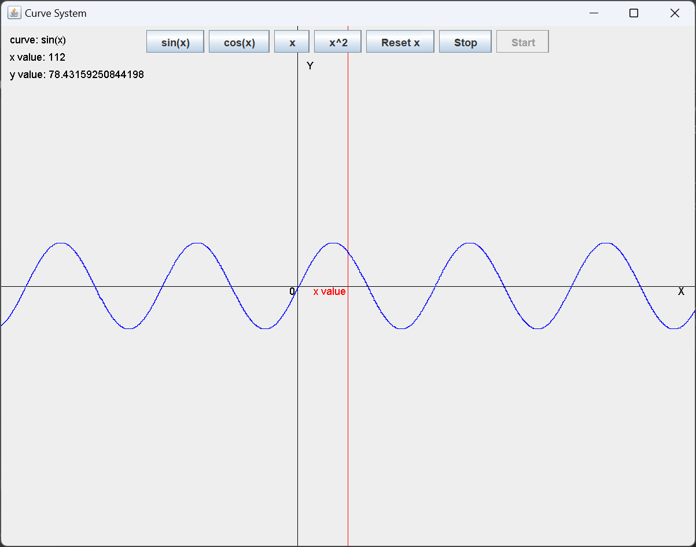
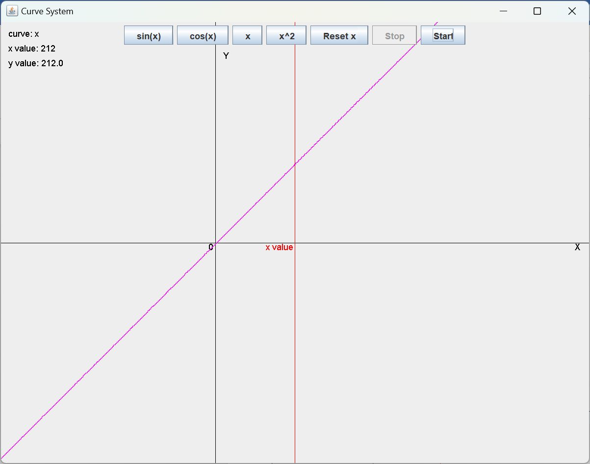
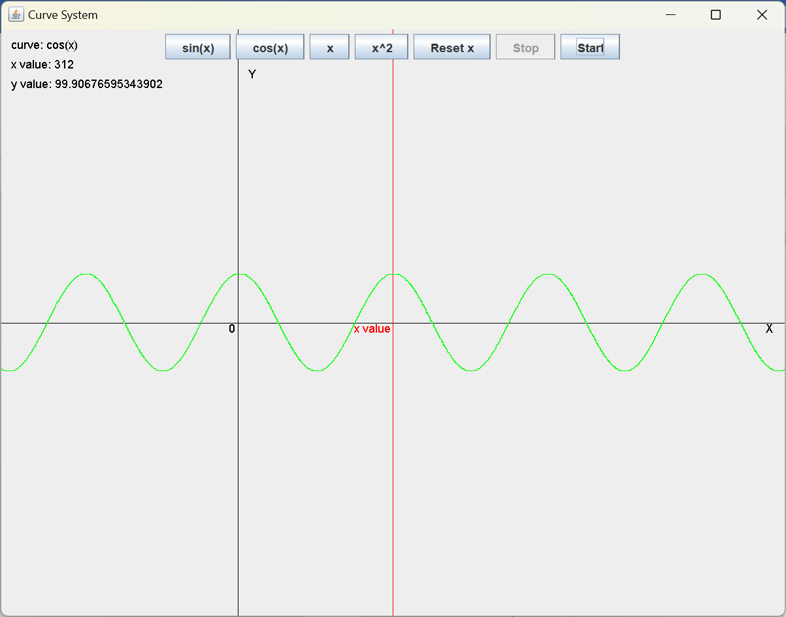
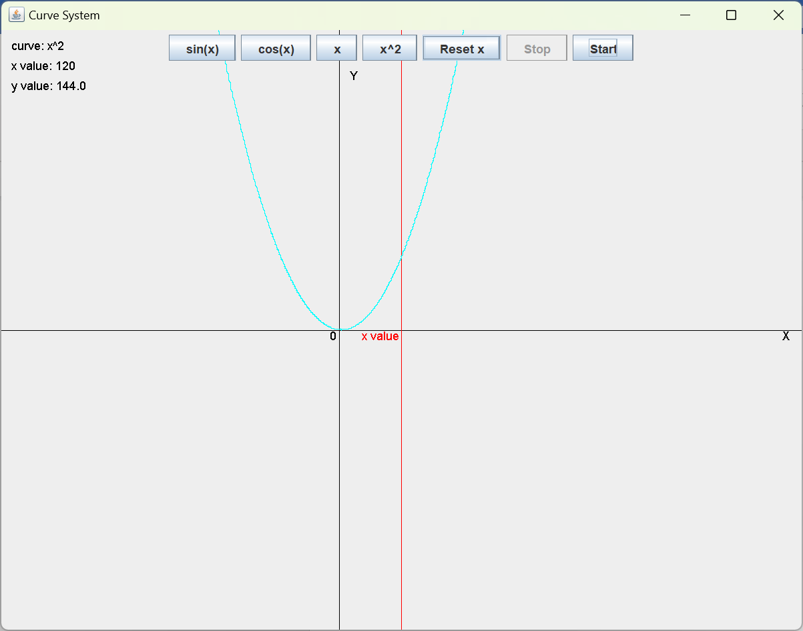

# simple-curve-system

基于 JavaSwing 的简单动态曲线系统：在图形界面 (GUI) 上动态绘制几种自左至右移动的简单曲线，同时动态显示对应坐标值。运用多线程，泛型同步技术，实现曲线动态同步绘制，曲线绘制与对应坐标数值的同步显示。曲线绘制的用户自主切换，启停，重置。

[个人网站：www.bytesc.club](http://www.bytesc.club)

# 功能介绍

- 在 JavaSwing 图形界面 (GUI) 上动态绘制几种自左至右移动的简单曲线，同时动态显示对应坐标值
- 运用多线程，泛型同步技术，实现曲线动态同步绘制，曲线绘制与对应坐标数值的同步显示
- 实现曲线绘制的用户自主切换，启停，重置
- 注释详细，易复现

# 功能展示

曲线系统包含四个函数切换按钮，一个重置x坐标按钮，和两个互斥的启停按钮。红线为当前x的值，黑线是坐标轴。



可以看到函数图像y=x的x和y值相对，x和y的值显示正确且同步。



多种曲线。




# 项目运行

java 版本 1.8.0_361

在项目根目录下，编译

```bash
javac -encoding utf8 CurveSystem.java
```

运行

```bash
java -Dfile.encoding=utf8 CurveSystem
```

# 项目结构

```txt
│  CurveSystem.class
│  CurveSystem.java
│  LICENSE
│  README.md
│
└─readme_img
```

- `CurveSystem.java` 是源代码文件
- `CurveSystem.class` 是编译后的字节码
- `readme_img` 文件夹存放 readme 文档的图片
